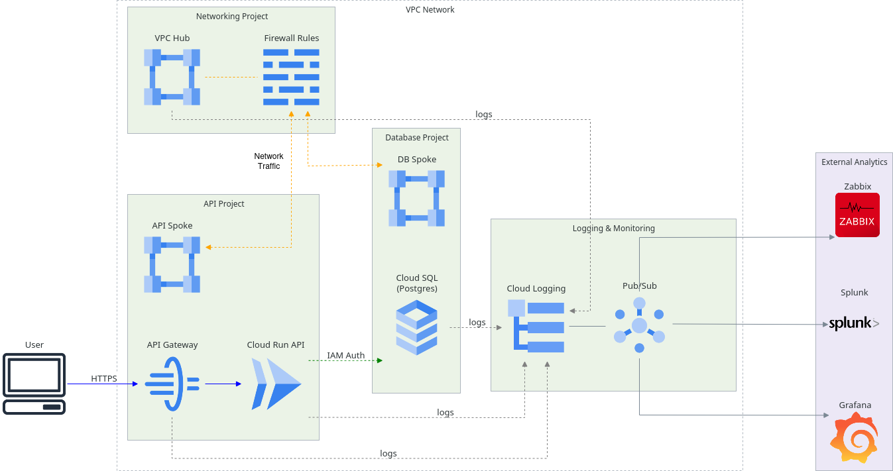

# Note Taking App

## Local Setup

### Prerequisites
The application of the local infrastructure is entirely dockerized and thus require the installation of the following:
- [docker Engine](https://docs.docker.com/engine/install/)
- [docker desktop](https://docs.docker.com/desktop/#next-steps)

Also make sure that before running the application, Docker Desktop is **running** in the background!

### Deployment
To deploy the application you simply have to execute the steps laid out in the *docker-compose.yml* file:
```
git clone https://github.com/dobikrisz/KLM-homework.git
cd "KLM-homework"
docker compose -f docker-compose.yml up --build
```

To destroy the setup and create a clean slate, just simply destroy the runners with:
```
docker compose -f down -v
```

The `-v` flag is for deleting the volumes so the data saved in the database gets removed too. If you want to keep the data, just skip using this flag.

### Usage
After the deployment successfully ran, you can interact with the API service in three different ways. All notes have the same attributes:
- *id* - Unique identifier of the note (automatically assigned)
- *time_created* - Time and date of creation (automatically assigned, cannot be changed)
- *time_updated* - time and date of last update to the note if any update happened, otherwise null (automatically assigned)
- *title* - title of the note (required)
- *content* - content of the note (required)
- *creator* - who created the note (required)

#### CMD
You can use a command line tool like *curl* to send and request data from the API:

##### Get all notes:
```
curl -X 'GET' \
  'http://127.0.0.1:5000/notes' \
  -H 'accept: application/json'
```
##### Post a note:
```
curl -X 'POST' \
  'http://127.0.0.1:5000/notes' \
  -H 'accept: application/json' \
  -H 'Content-Type: application/json' \
  -d '{
  "title": "string",
  "content": "string",
  "creator": "string"
}'
```
##### Get a single note
```
curl -X 'GET' \
  'http://127.0.0.1:5000/notes/1' \
  -H 'accept: application/json'
```
##### Update a note
```
curl -X 'PUT' \
  'http://127.0.0.1:5000/notes/1' \
  -H 'accept: application/json' \
  -H 'Content-Type: application/json' \
  -d '{
  "title": "string",
  "content": "string2",
  "creator": "string"
}'
```
##### Delete a note
```
curl -X 'DELETE' \
  'http://127.0.0.1:5000/notes/1' \
  -H 'accept: application/json'
```

#### Swagger
You can reach the swagger API documentation and test out the API on the following link:
```
http://127.0.0.1:5000/docs
```

#### Test Frontend
You can test out the application via the Frontend application:
```
http://127.0.0.1:8501/
```

## CI/CD Pipeline - proposed design

During the design of the CI/CD pipeline, two separate concerns should be taken into account: The deployment of the cloud infrastructure and the deployment of the application images. These pipelines should be handled separately as pushing a change in infrastructure shouldn't necessarily trigger a rebuild of application images, but pushing a new version of the images should trigger a recreation of the cloud run service to create a new version with the updated image, so traffic can be diverted into it.

### Selecting a service
First, we have to select the CI/CD service we will utilize. The GCP native solution, Cloud Build seems like a self-evident choice as it is integrated into the cloud workflow and setting it up is quite easy, however it is less flexible than other available choices like Gitlab CI/CD or Github Actions, also in my opinion, its configuration design is quite unwieldy.

To implement an external CI/CD solution like Github Actions, all we have to do is to setup a Service Account on the cloud to act as an agent and configure the Workload Identity Federation for authentication so we can avoid unnecessary secret management operational overhead.

In this documentation, Github Actions will be the preferred choice. Using Github Actions, setting up the authentication requires only a few lines and most developers are already familiar with the Github ecosystem.

### Pipeline design

#### Image Deployment
The first pipeline is to build and push the image to an image repository. If no other requirement is present the GCP's artifact registry is a sufficient place to store the images so Cloud Run service can easily access it. Before the build process, unit tests, linting, security scanning can be performed on the code base.

Proposed high-level Pipeline design:
```yaml
name: Image Deployment
run-name: ${{ github.actor }} is testing and building API image

on:
  push:
    branches: [ "main" ]

env:
  PROJECT_ID: fake-app-323017
  REGION: eu-west3
  GAR_LOCATION: eu-west3-docker.pkg.dev/fake-app-323017/repo-1/

jobs:
  deploy:
    runs-on: ubuntu-latest
  test:
    steps:
      - name: Set up Python
        uses: actions/setup-python@v5
        with:
          python-version: 3.11
      - name: Install dependencies
        run: |
            python -m pip install --upgrade pip
            pip install -r requirements.txt

      - name: pylint check
        run: |
            pylint $(find . -name "*.py" | xargs) --fail-under=9.5

      - name: pytest test
        run: |
            CI=true
            coverage run -m pytest tests/
            coverage report --fail-under=90

      - name: security scanning
        run: <security scan>

  build:
     steps:
      - name: Authenticate to Google Cloud
        uses: google-github-actions/auth@v2
        with:
          workload_identity_provider: "WIF_provider"
          service_account: "Service_Account"
          token_format: 'access_token'
          access_token_lifetime: '60s'

      - name: "Docker auth"
        run: |-
          gcloud auth configure-docker ${{ env.REGION }}-docker.pkg.dev --quiet

      - name: Build image
        run: docker build . --file DOCKERFILE_LOCATION --tag ${{ env.GAR_LOCATION }}
        working-directory: WORKING_DIRECTORY

      - name: Push image
        run: docker push ${{ env.GAR_LOCATION }}
```

#### Infrastructure deployment
Deploying the infrastructure can be done by an IaC tool like Terraform. One difficulty of updating it when a new image is being deployed that by default the Cloud Run Instance won't ingest the new published image automatically. To solve this, after we update the image in the Artifact Repository, we update the version of the image used by the Cloud Run. In this way we can ensure that the developer pushing the change will observe that the infrastructure is running correctly after deployment, while if we'd automated the whole process, an incorrect deployment could be easily missed.

Proposed high-level design of infrastructure pipeline
```yaml
name: Deploy Infrastructure

# Controls when the workflow will run
on:
  # Triggers the workflow on push or pull request events but only for the "main" branch
  push:
    branches: [ "main" ]
  pull_request:
    branches: [ "main" ]


  # Allows you to run this workflow manually from the Actions tab
  workflow_dispatch:
    inputs:
      action:
        description: 'Terraform action to run'
        required: true
        default: 'apply'
        type: choice
        options:
          - apply
          - destroy

jobs:
  deploy:
    runs-on: ubuntu-latest

    permissions:
      id-token: write
      contents: read

    env:
      GOOGLE_PROJECT_ID: ${{ secrets.GOOGLE_PROJECT_ID }}
      REGION: ${{ secrets.REGION }}
      ZONE: ${{ secrets.ZONE }}
      BUCKET: ${{ secrets.BUCKET }}

    steps:
      - name: Checkout code
        uses: actions/checkout@v3

      - name: Authenticate to Google Cloud
        uses: google-github-actions/auth@v2
        with:
          workload_identity_provider: ${{ secrets.WORKLOAD_IDENTITY_PROVIDER }}
          service_account: "github-actions-sa@${{ env.GOOGLE_PROJECT_ID }}.iam.gserviceaccount.com"
          token_format: 'access_token'
          access_token_lifetime: '3600s'

      - name: Create Backend Bucket
        run: |
          if ! gcloud storage ls | grep ${{ env.BUCKET }} &>/dev/null; then
            echo "Bucket does not exist. Creating bucket..."

            gcloud storage buckets create gs://${{ env.BUCKET }} --project=${{ env.GOOGLE_PROJECT_ID }} --location=EU
          else
            echo "Bucket ${{ env.BUCKET }} already exists."
          fi

      - name: Set up Terraform
        uses: hashicorp/setup-terraform@v3
        with:
          terraform_version: "1.11.4"

      - name: Terraform Init
        working-directory: infrastructure
        run: terraform init -backend-config="bucket=${{ env.BUCKET }}"

      - name: Terraform Action
        working-directory: infrastructure
        env:
          TF_VAR_PROJECT_ID: ${{ env.GOOGLE_PROJECT_ID }}
          TF_VAR_REGION: ${{ env.REGION }}
          TF_VAR_ZONE: ${{ env.ZONE }}
        run: |
          if [[ "${{ github.event_name }}" == "workflow_dispatch" ]]; then
            terraform ${{ github.event.inputs.action }} -auto-approve
          else
            terraform apply -auto-approve
          fi
```

With this configuration we initially create a backend bucket on GCP where the state file of Terraform will be stored and we deploy (or destroy) the infrastructure. Since in Github Actions manual approval is not an option (unless using GH enterprise), the infrastructure first should be deployed to a dev environment to see if changes are correct. Or the setup could be modified so terraform plan runs on the dev branch and apply only runs on the main or production branch.


## Cloud Infrastructure (GCP) - proposed design

### Overview

The cloud infrastructure was designed with the possibility of further expansion and scaling of the project. Most choices were made to prefer cloud native solutions and to make use of managed services as much as possible. The project could be significantly simplified if no further functionality or security is needed (e.g.: it is just a P.O.C. or a simple backend of an in-house tool) as everything could be fitted into a single project without any Networking or Logging, but generally preparing for increased complexity down the road is advised.

### General Design


The simplified design diagram of the Cloud Infrastructure can be seen above. The Infrastructure uses a multi-project setup to clearly separate responsibilities in a clear and easy to understand manner. Further separation can be achieved with utilizing the Folders resource of Google Cloud and projects can be split into dev, staging and prod environments (or a separate organization with a mirrored architecture can be created but usually it is good practice to keep all things in one organization to avoid user-management, logging and monitoring overhead). Access to resources can be managed by IAM role based access and for external agents (e.g.: CI/CD pipeline workers) with Service Accounts.

For Security and reproducibility purposes it should be generally advised to interact with the Environment via Automated CI/CD pipelines and IaC (e.g.: terraform) tools so certain principles can be enforced and changes can be easily traced. Manual modification should only happen in special cases and preferably should be documented.

Pipelines can be authenticated through Service Accounts with Workload Identity Federation which would allow the creation of short/lived tokens which behave similarly to SA keys but no key management is required.

#### API architecture
The API architecture encompasses only a few resources as sufficient performance can be easily achieved with managed services. Here, we have 2 important projects which host 2 crucial parts of our application: *API project* and *Database project*. the *API project* hosts the resources needed for the API functionality and the *Database project* hosts the PostgreSQL. I chose to separate them so if other services being implemented which require SQL database, they can be handled in one place logically, so no separate logging and networking apparatus will have to be developed.

The API itself is chosen to be hosted on a Cloud Run instance. It is the simplest resource to use when we want to migrate our local Python API to the cloud as it also uses Docker images, it scales automatically and is managed by Google. So deploying our local code can happen practically without any modification. Other services like Cloud Engine or GKE would introduce significant operational overhead while not saving significant amount of money. Firebase was also considered but since it's also utilizes Cloud Run instances and it is technically a separate service from GCP with its own SDK and Console, it was rejected.

The Cloud Run instance itself while presented in the VPC network, is technically visible on the public internet as public invocations are expected but if the app will be used by a separate cloud service later on, it can be also made private by getting rid of the Public IP. The Cloud Run has an API Gateway in front of it which manages traffic, provides the possibility to use a custom url and handles load balancing. API Gateway was chosen because it is a lightweight API manager which can use multiple different GCP services and quick to setup. Apigee would be pricey and way to complex to the current scale and API Endpoints is considered outdated and in "legacy mode" by Google.

#### Database
Database was chosen to be a Cloud SQL Google managed Postgres instance. While it can be a bit expensive, no solution seem to be ideal from this POV and the benefits of Cloud SQL like easy setup, Role Based access instead of the necessity of key management, Ability to create backups and easy to setup multi-zone databases outweighs its problems. Authentication from the Cloud Run instance to the Cloud SQL happens via IAM Authentication which allows to Authenticate into to Postgres through a Cloud Run Service Account with IAM roles and short-lived OAuth 2.0 tokens, and Key and secret management can be skipped. If this is not sufficient due to some security requirements, GCP native Secret Manager and Key Management should be enough.

#### Networking
A networking setup is not strictly required for this project as GCP managed services and role base access allows the services to communicate between each other. But for security reasons and for preparation for further workloads being deployed in our Infrastructure, a preliminary network was designed.

The structure of the network was chosen to be the classic Hub-and-Spoke model for its flexibility and high security. It is a bit complex to setup but if deployment is sufficiently automated, it should not be a serious concern.

The entire organization is surrounded by a VPC perimeter in order to avoid data filtration. Only out facing appliances like API gateway and Cloud Run can communicate with the public internet. All traffic goes trough a Hub network and traffic is managed by firewall rules.

#### Logging
Logging is handled in a dedicated project where all logs are collected in dedicated log buckets. In this way, querying and analyzing logs is much easier. From here, logs can be passed to a Pub/Sub topic and be sent over to external log analyzing systems like Splunk or Grafana.